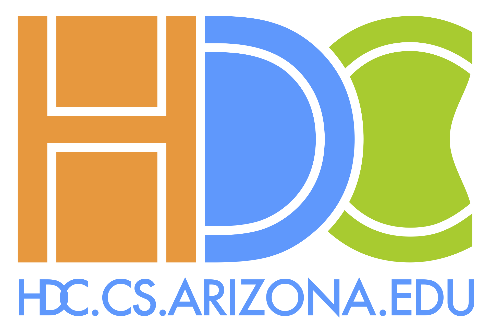
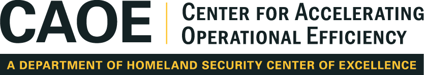

---
---

## Welcome to AZ VIS 2021!

The University of Arizona and Arizona State University are jointly organizing an [IEEE VIS](http://ieeevis.org/) 2021 [satellite event](http://ieeevis.org/year/2021/info/call-participation/satellite) in Tucson, AZ, Oct. 24-29. 

#### Who we are

This event will bring together multiple communities, including the [HDC](http://hdc.cs.arizona.edu/), [VADER](http://vader.lab.asu.edu/), and [SVL](https://chrisbryan.github.io/research/) visualization research groups. 

Additionally, this event interfaces with the larger Data Science communities
of both campuses, particularly the UA's [Data Science Institute](https://datascience.arizona.edu/) and [UITS Research Computing](https://it.arizona.edu/research).

## What's happening during the week

Our satellite event will host viewing options for the virtual [IEEE VIS 2021 Program](http://ieeevis.org/year/2021/info/week-at-a-glance), 8:00am-11:30am MST daily starting on Monday, October 25, in addition to [local programming](#local-programming) throughout the week.

#### Email Signup and IEEE VIS Registration

Please complete [our sign up form](https://forms.gle/AYqFW2EbrF9LMe7j6) to receive updates via our event mailing list.

Conference registration is free to students and will be handled by IEEE VIS.  [Register for IEEE VIS here](http://ieeevis.org/year/2021/info/registration/conference-registration)


*** 

 Deadlines for DC/LT signups are Oct. 12 (rolling), 
Deadlines for VSL/BOF are <s>Oct. 19</s> (extended to) Oct. 23!

***


#### Schedule

([Registering for the IEEE VIS conference](http://ieeevis.org/year/2021/info/registration/conference-registration) will provide access to information about each of these events through the [virtual conference website (virtual.ieeevis.org)](https://virtual.ieeevis.org/).)

| Day       | Times (MST)     | Event | Rooms |
|:----------|:----------------|:------|:------|
| Mon.    | 1:30pm-4:00pm   | *Doctoral Colloquium (DC) (invite-only)* | HSIB 320/321 |
|:----------|:----------------|:------|:------|
| Tues.   | 7:30am-8:00am   | *AZ VIS Local Opening*        | HSIB 305 |
|           | 8:00am-9:30am   | VIS Best Paper Session        | HSIB 305 |
|           | 9:30am-10:00am  | Coffee Break                  | |
|           | 10:00am-11:00am | VIS Keynote                   | HSIB 305 |
|           | 11:00am-1:00pm  | *AZ VIS Showcase Lunch (VSL)* | HSIB Annex |
|           | 1:00pm-2:30pm   | *AZ VIS Lightning Talks (LT)* | HSIB 305 |
||| --- [LT Program Schedule](#lightning-talks-lt) --- | |
|:----------|:----------------|:------|:------|
| Wed. | 8:00am-9:30am   | VIS Parallel Sessions         | |
||| --- Papers: Multi-View and Visual Environments | HSIB 320 |
||| --- Papers: CG&A - Data Physicalization| HSIB 321 |
||| --- Short Papers: AI+VIS | HSIB 442 |
||| --- Panel: What is the Role of VIS in Combating COVID-19? | HSIB 443 |
|           | 9:30am-10:00am  | Coffee Break                  | |
|           | 10:00am-11:30am | VIS Parallel Sessions         | |
||| --- Papers: Immersive Environments, Personal Vis, &nbsp;&nbsp;&nbsp;&nbsp; and Dashboards | HSIB 320 |
||| --- Papers: Multi-Dimensional Data | HSIB 321 |
||| --- Papers: CG&A - Visualizing big issues: Culture, &nbsp;&nbsp;&nbsp;&nbsp; Climate Change, and Communities | HSIB 442 |
||| --- Arts Program: VISAP Session 1 | HSIB 443 |
|           | 11:30am-1:00pm  | *AZ VIS Birds-of-a-Feather Lunch (BOF)* | HSIB Annex |
|:----------|:----------------|:------|:------|
| Thurs.  | 8:00am-9:30am   | VIS Parallel Sessions         | |
||| --- Papers: Grammar and Learning | HSIB 320 |
||| --- Short Papers: Graphs, Charts, and Perception | HSIB 321 |
||| --- App Spotlight: Challenges for Visualization in &nbsp;&nbsp;&nbsp;&nbsp; Immersive Planetarium Domes | HSIB 442 |
||| --- Panel: Towards Accessible Data Representations | HSIB 443 |
|           | 9:30am-10:00am  | Coffee Break                  | |
|           | 10:00am-11:30am | VIS Parallel Sessions         | |
||| --- Papers: Time Series and Events | HSIB 320 |
||| --- Papers: Graphs and Trees | HSIB 321 |
||| --- Papers: Mitigating Bias | HSIB 442 |
||| --- Short Papers: Applications | HSIB 443 |
|           | 11:30am-1:00pm  | VIS 2022 Kickoff / Townhall   | HSIB 322 |
|           | 12:00pm-1:00pm  | Student Mentorship Session    | HSIB 323 |
|:----------|:----------------|:------|:------|
| Fri.    | 8:00am-9:30am   | VIS Parallel Sessions         | |
||| --- Papers: Model Evaluation | HSIB 305 |
||| --- Papers: Biological and Medical Visualization | HSIB 306 |
||| --- App Spotlight: Visualization Challenges in Deep Uncertainty | HSIB 320 |
||| --- Panel: Navigating Interdisciplinary Careers in Visualization | HSIB 321 |
|           | 9:30am-10:00am  | Coffee Break                  | |
|           | 10:00am-11:30am | VIS Capstone                  | HSIB 305 |
|:----------|:----------------|:------|:------|

### Local Programming

In addition to hosting events from the main conference we are organizing four different local events to highlight the exciting visualization work happening in southern AZ, build connections between the many communities, and offer opportunities for celebrating visualization.

#### VIS Showcase Lunch (VSL) 
 (Signup: [https://forms.gle/ZHjJsu5zfkMkrZjx7](https://forms.gle/ZHjJsu5zfkMkrZjx7))  
Find out more about the visualization researchers in our local southern AZ community in an informal setting where we eat, chat, and talk about recent work.  Meet and mingle with VIS researchers from ASU and UA and share lunch on Tuesday.

#### Birds-of-a-Feather (BOF) Lunch 
 (Signup: [https://forms.gle/r7b1be2fkBYHotoM8](https://forms.gle/r7b1be2fkBYHotoM8))   
Talk about specific VIS-related topics with those who share the same passions as you.  We provide lunch, and you provide the discussion topics.  We will group people by table based on topics of interest to discuss on Wednesday

#### Lightning Talks (LT) 
 (Signup: [https://forms.gle/tKWkr2ThpkH1THx3A](https://forms.gle/tKWkr2ThpkH1THx3A))  
An opportunity to present your work related to visualization! The talks are limited to three minutes each. You do not have to be a visualization specialist to participate. We invite talks from all visualization-interested parties across Arizona.  

Preliminary Schedule for the LTs, Tuesday, Oct. 25, 1:00-2:30pm:

| Time | Presenter | Title |
|:-----------|:----------|:------|
1:00pm | Aditi Mishra | Why? Why not? When? Visual Explanations of Agent Behavior in Reinforcement Learning 
1:05pm | Dorsey Kaufmann | Workshop to Prototyping: Identifying web viz requirements from  participatory stakeholder activities
1:10pm | Yixuan Wang | Cost-Benefit of Interactive Labelling System
1:15pm | Brian Bollen | Contour Tree Edit Distance
|:-----------|:----------|:------|
1:20pm | Jinbin Huang | Visualization on Multi-modality
1:25pm | Winslow Burleson | UArizona Holodeck: A Convergence Catalyst for Research, Education,  and Innovation
1:30pm | Tiankai Xie |  Explaining Vulnerabilities to Adversarial Machine Learning through  Visual Analytics
1:35pm | Sayef Azad Sakin | Designing scalable timeline charts for millions of tasks
|:-----------|:----------|:------|
1:40pm | Devin Bayly | The Future of Research Technologies Remote Display
1:45pm | Kairong Jiang | Error Diagnosis for Volume Rendering Surrogates
1:50pm | Jieqiong Zhao | Exploring Moral Foundations Framings in Terrorist Organizations
|:-----------|:----------|:------|
2:00pm | All | Informal discussions between presenters and audience

#### Doctoral Colloquium (DC) 
 (Signup: [https://forms.gle/26Jk2QKpycEH5cdb9](https://forms.gle/26Jk2QKpycEH5cdb9))  
Participating Ph.D. students present their proposed dissertation work and receive feedback from leading visualization researchers. We invite contributions from student communities involved in all areas of visualization.  

## Event Logistics 

#### Location 

We are reserving space for the week in the [Health Sciences Innovation Building (HSIB)](https://uahs.arizona.edu/scheduling/tucson-hsib).

For our out-of-town visitors, we can work with you to handle reservations at nearby hotels such as [Aloft Tucson University](https://www.marriott.com/hotels/travel/tusal-aloft-tucson-university/) and [Tucson Marriott University Park](https://www.marriott.com/hotels/travel/tusmp-tucson-marriott-university-park/).

#### Code of Conduct

All attendees of AZ VIS are subject to the [IEEE VIS Code of Conduct](http://ieeevis.org/year/2021/info/inclusion-and-diversity/code-of-conduct) and [IEEE Code of Conduct](https://www.ieee.org/conferences/event-terms-and-conditions.html#event-conduct-and-safety).

## Local Organizers

**Organizational Chairs**

Joshua A. Levine (UA, HDC) (for inquiries, contact [josh@email.arizona.edu](mailto:josh@email.arizona.edu)) \
Ross Maciejewski (ASU, VADER) \
Nirav Merchant (UA, DSI) \
Maliaca Oxnam (UA, DSI) 

**Organizational Committee**

Devin Bayly (UA, UITS) \
Chris Bryan (ASU, SVL) \
Katherine Isaacs (UA, HDC) \
Stephen Kobourov (UA, HDC) \
Carlos Scheidegger (UA, HDC)

<table style="text-align: center;">
<tbody style="border: none">
<tr><td>   </td></tr>
<tr>
<td></td>
<td></td>
<td></td>
</tr>
<tr><td>   </td></tr>
</tbody>
</table>

#### Acknowledgments

The venue for this event was sponsored by University of Arizona Health Sciences administration [https://uahs.arizona.edu/](https://uahs.arizona.edu/)

We respectfully acknowledge the University of Arizona is on the land and territories of Indigenous peoples. Today, Arizona is home to 22 federally recognized tribes, with Tucson being home to the O’odham and the Yaqui. Committed to diversity and inclusion, the University strives to build sustainable relationships with sovereign Native Nations and Indigenous communities through education offerings, partnerships, and community service.
